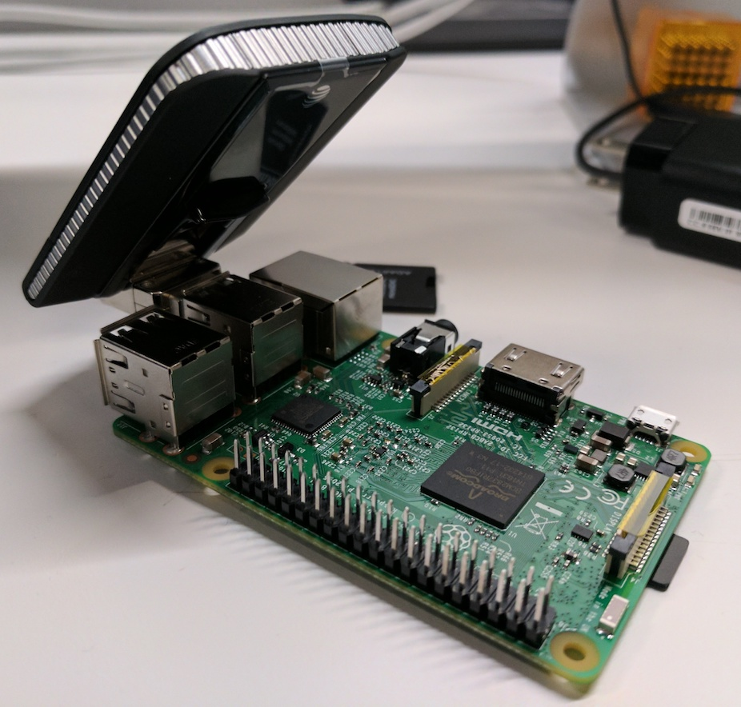

# lte-pi
A simple systemd unit file and service for the AT&T aircard 340U LTE card





## Install
Clone the repo (or copy it via flash drive)
```
./install.sh
```

## Uninstall
```
./uninstall.sh
```
If you don't see the card connected on the card's display, run `reboot` and check for a connection on the card's display

---
The above commands should be all you need, however, if you need to manually start or stop the services, this is how that works.

## Manual Start
Note: You shouldn't need to do run either of these unless something goes wrong
```
sudo systemctl start aircard.service
```

## Manual Stop
```
sudo systemctl stop aircard.service
```

## If systemctl isn't available
```
sudo /usr/bin/aircard.sh start
```
```
sudo /usr/bin/aircard.sh stop
```
```
sudo /usr/bin/aircard.sh restart
```

## License
[MIT]('./LICENSE')

## Contributors
qbunt